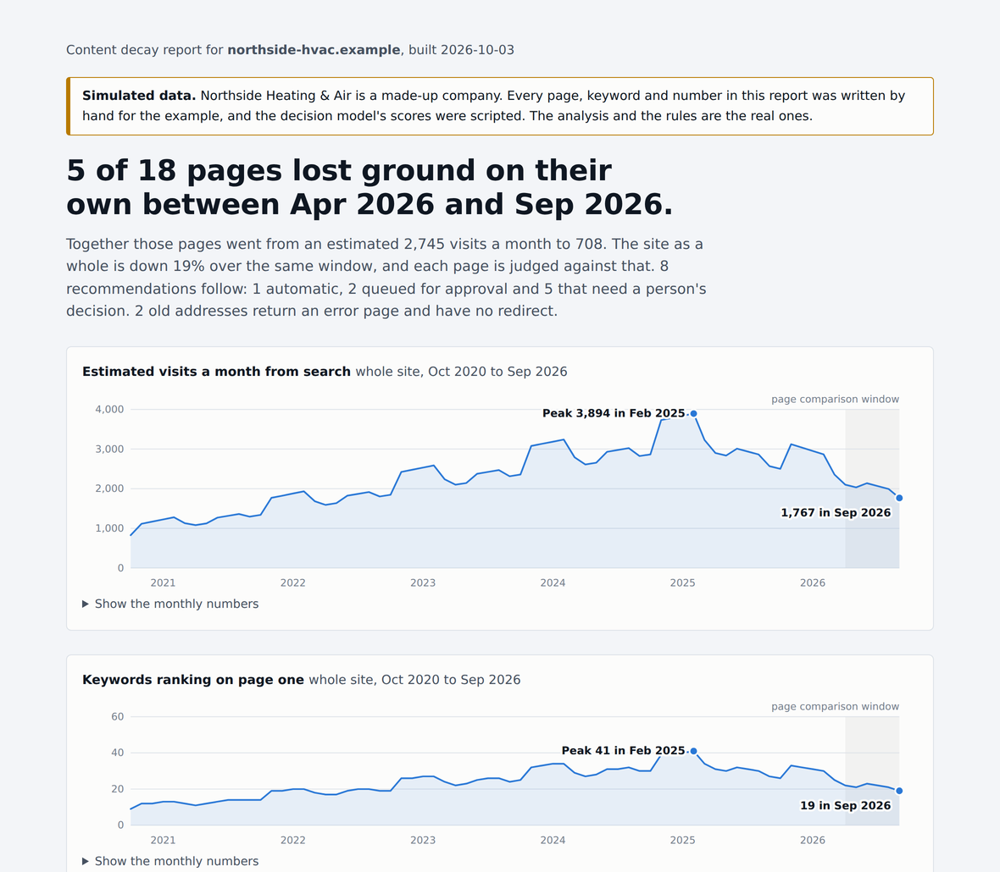
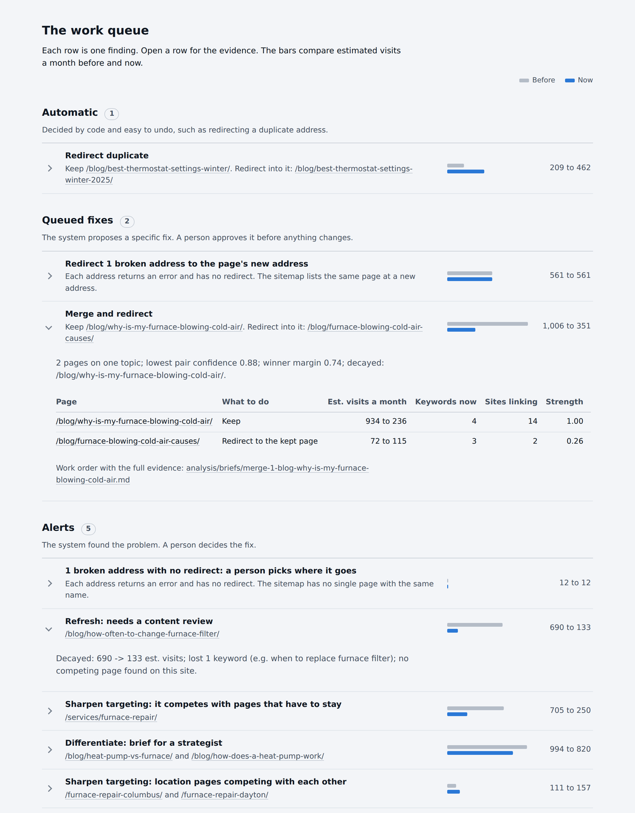

# Content decay solution

Give it a website. It finds the pages that are losing search rankings, says why, recommends a fix for each one,
and writes the result as a work queue a person (or, later, another agent) can act on.

It is a working prototype. It has been run on five real sites and checked against a person's judgment, and this
README says plainly where it fell short.



*The example report. The company and every number in it are made up; see [Try it](#try-it-in-ten-seconds).*

## The problem

An agency that looks after hundreds of client websites cannot watch every page. Pages lose rankings over time,
and the losses are caught by hand, late and unevenly. Before any of that can be automated, four questions need
answers:

1. **What does "decayed" mean, in numbers?**
2. **Can a system find decayed pages and pick the fix as well as a person does?**
3. **Which fixes are safe to automate, which need approval, and which are only an alert?**
4. **Where does the output go so the work gets done?**

This repo is one answer to each, built and tested end to end.

## What it does

For one site, one command runs nine steps:

| # | Step | Needs | What it does |
|---|---|---|---|
| 1 | Pull rankings | DataForSEO (paid) | Every keyword the site ranks for, the page that ranks, its position now and at the previous check |
| 2 | Find decayed pages and competing pairs | nothing | Applies the decay definition to every page; finds pairs of pages that compete for the same searches |
| 3 | Judge the pairs | local decision model | Asks "are these two pages about the same subject?" and records a probability |
| 4 | Check live addresses | the site | Does each page load, redirect or return an error today? Ranking data lags the live site |
| 5 | Map page types | the site | Types every page (article, service page, location page, ...) from the sitemap, the page's code, its URL and Google's publish date |
| 6 | Fetch page text | the site | Saves headings and paragraphs so shared text between two pages can be measured |
| 7 | Recommend | nothing | Applies the rules below; writes the work queue and one work order per finding |
| 8 | Score keyword fit | local decision model | For pages that should stay separate, suggests which page should own each shared search |
| 9 | Build the report | nothing | One HTML page, readable offline |

Steps 4, 5, 6 and 8 add evidence. If one of them fails, the run carries on and the summary says so. If any
other step fails, the run stops.

The decisions are made by code and a small decision model that returns a probability, not by a chat model. The
rules are fixed, the model gave identical scores when 79 pairs were judged a second time, and every question and
answer is logged.

## Try it in ten seconds

No account, no model and no network needed. Python 3.10 or later; nothing to install.

```
git clone <the address of this repo>
cd content-decay-solution
python3 example/make_example.py
open example/data/northside-hvac.example/report.html
```

This builds made-up ranking data for a made-up heating company and runs it through the real pipeline. The
report says "Simulated data" at the top. What is real and what is simulated is spelled out at the top of
[`example/make_example.py`](example/make_example.py).

Nothing from a run is kept in the repo, so the example is built on your machine each time. It writes the same
files a real run does, under `example/data/northside-hvac.example/`:

- `report.html`: the report
- `run_summary.md`: the result in plain words
- `analysis/recommendations.csv`: the work queue as a table
- `analysis/briefs/`: one work order per finding

The example is built to show one of each kind of finding:



## What "decayed" means

A page is decayed when all three are true:

| Rule | Threshold | Why |
|---|---|---|
| It mattered | At least 10 estimated visits a month at the previous check | Tiny pages swing wildly; flagging them wastes people's time |
| It fell | Estimated traffic down 30% or more since the previous check | A clear drop, not normal movement |
| It fell on its own | Its change is at least 15 points worse than the whole site's change | Separates "this page has a problem" from "the whole site, or the whole market, moved" |

The third rule matters most. In the example, one page is down 30% and is **not** flagged, because the site as a
whole is down 19%.

The full definition, how the numbers are calculated and what they cannot show:
[`docs/DECAY_DEFINITION.md`](docs/DECAY_DEFINITION.md).

## How the fix is chosen

The fix depends first on whether another page on the same site competes for the same searches. For each pair of
pages that do, the first rule that applies decides:

1. One address already redirects, or no longer loads: no merge decision is needed.
2. The same page at two addresses, or the same title apart from the year: a duplicate to redirect.
3. Either page is not an article: **keep both.** Homepages, index pages, service pages, location pages, podcast
   and video pages, and pages whose type could not be confirmed are never merged.
4. Two articles on the same topic (decision model 0.70 or higher) where the smaller one shares at least half its
   searches: **merge.**
5. Related topic (0.60 or higher) and at least two searches have swapped between the pages: **differentiate.**
6. Otherwise: **separate.** Nothing is recommended.

A decayed page with no competing page gets a "refresh" alert. An address that returns an error while searches
or links still point at it gets a "broken address" finding, with the page's new address when the sitemap shows
one.

Each finding lands in one of three tiers:

| Tier | Meaning | Examples |
|---|---|---|
| **Automatic** | Decided by code and easy to undo | Redirect a duplicate address |
| **Queued fix** | The system proposes a specific fix; a person approves it | Merge two articles; redirect a broken address to its new one |
| **Alert** | The system found the problem; a person decides the fix | Differentiate two pages; refresh a page; a close-call merge |

Nothing in this prototype changes a website. "Automatic" means a fix the evidence says could be automated, not
one that is.

When the system cannot tell, it does nothing. A page typed "unknown" is never merged, and "keep both" is the
default, because a wrong merge costs more than a missed one.

## Tested against a person

A reviewer labeled every competing pair on three sites by hand, without seeing the system's answers.

| | Site A, legal marketing (38 pairs) | Site B, legal marketing (37 pairs) | Site C, heating and cooling (15 pairs) |
|---|---|---|---|
| Decision model alone | 8 of 17 merge calls right | 0 of 17 right | 2 of 5 right |
| Rules v2 | 9 of 10 right *(tuned on these labels)* | **0 of 15 right** *(unseen site)* | not run |
| Rules v4 (current) | 8 of 9 right *(tuned)* | no merges proposed; reviewer agreed *(tuned)* | **2 of 2 right, all 15 pairs matched** *(unseen site)* |

Only the two bold results are honest tests: the system's answers were saved before the reviewer labeled
anything. The first is a failure. Rules that scored 9 of 10 on the site they were tuned on proposed 15 merges on
the next site, and the reviewer agreed with none, because that site had a page type (city pages) the first one
did not. The rules were rebuilt around a page map, and the next unseen site passed.

What this does and does not show:

- One pass on 15 pairs is a start, not proof. Each new kind of site should be checked the same way: save the
  answers first, then have a person label them.
- The reviewer still caught three things the system missed on Site C.
- One person labeled all three sites, and that person also built the system. There is no second opinion.
- Whether acting on the recommendations improves rankings has not been tested.

The full record, round by round: [`docs/HUMAN_VS_SYSTEM.md`](docs/HUMAN_VS_SYSTEM.md).

## Run it on a real site

You need:

- **Python 3.10 or later.** The pipeline uses only the standard library.
- **A DataForSEO account.** Put the API login in `~/.openclaw/dataforseo.env`, readable only by you:
  ```
  DATAFORSEO_LOGIN=you@example.com
  DATAFORSEO_PASSWORD=your-api-password
  ```
  The login is never passed on the command line.
- **The decision model running locally.** The pipeline was built with [Kev](https://github.com/jaredpalmer/kev),
  a small open-source model that answers a yes/no question with a probability instead of writing text. This
  build used the 0.8B version (`jaredpalmer/kev-0.8b`). Follow that repo's instructions to install it, then,
  from its folder, serve it on port 8009:
  ```
  uv run --extra serve python -m kev.serve --run jaredpalmer/kev-0.8b --port 8009
  ```
  Set `KEV_URL` if it is served somewhere other than `http://127.0.0.1:8009/v1/systemone`.

Then:

```
cd pipeline
python3 run_site.py example.com             # uses ranking data already on disk if there is any
python3 run_site.py --fresh example.com     # pulls the rankings again (costs money)
python3 run_site.py --offline example.com   # only the steps that need nothing
```

A run takes about three to six minutes. Output goes to `~/openclaw/data/<site>/`; set `OPENCLAW_DATA` to change the
folder. Each step can also be run on its own (`python3 analyze_site.py example.com`, and so on); every script
explains itself at the top of its file.

**Cost.** The two most recent sites cost $0.39 each to pull (about 1,200 keyword rows each). The cost grows with
the number of keywords, up to about $1.53 at the 10,000-keyword cap. All the testing behind this repo cost about
$2.55 of ranking data.

**Limits built in.**

- The site name must be a plain domain. Anything else is refused before any step runs.
- Before a pull, the runner asks how many keywords the site has (about one cent), estimates the cost, and
  refuses if that is above $2.00 for the run or would take the day's total above $5.00.
- It checks that the decision model answers before it spends anything.
- One run at a time.

## Run it from an AI agent

The pipeline can be started by chatting with a local agent in [OpenClaw](https://docs.openclaw.ai): "run the
content decay check for example.com", then "what was the result?".

The agent runs in a sandbox with no internet and no ability to run commands, and none of that was loosened. It
asks for a run by writing a one-line file in its own workspace. A small watcher program outside the sandbox
picks the request up, checks it, runs the pipeline and writes the result back for the agent to read. The only
thing that crosses out of the sandbox is a domain name that has passed validation.

How it is wired, why the agent was not given command access, and what went wrong on the way:
[`docs/AGENT_WIRING.md`](docs/AGENT_WIRING.md).

## What a run writes

Under `~/openclaw/data/<site>/`:

| File | What it is |
|---|---|
| `report.html` | The report |
| `run_summary.md` | The result in plain words; every number is read from the files below |
| `analysis/recommendations.csv` | The work queue: one row per finding, with its tier and evidence |
| `analysis/briefs/` | One work order per merge, per pair to differentiate and per "sharpen targeting" finding |
| `analysis/redirect_map.csv` | Broken addresses and where each should redirect |
| `analysis/pages.csv` | Every page with its decay status |
| `analysis/pair_calls.csv` | Every competing pair with the call and the reason |
| `analysis/page_map.csv` | Every page's type and what each clue said |
| `analysis/kev_log.jsonl` | Every question put to the decision model and its reply |
| `analysis/run_status.json` | Each step: done, skipped or failed, and how long it took |

## Known limits

- **Estimates, not clicks.** Traffic is estimated from rankings. There is no Search Console data.
- **Ranking data lags.** Each keyword's position is as of its own last check, which can be weeks old. The live
  address check exists because of this, and the report says "at the last data check" where it matters.
- **Small evidence base.** Five sites, three of them labeled, one reviewer.
- **One kind of site.** All five are WordPress sites using the same sitemap plugin. Other platforms fall back to
  fewer clues, and that path has only been checked with made-up test pages.
- **Location pages need a known place.** The list covers US cities of 100,000 or more people and the states. A
  page for a smaller town is typed as an ordinary page: still never merged, but it misses the location advice.
- **Three known misses** on the last test site: a blank page was not flagged, three overlapping articles fell
  just under the bar for "differentiate", and six small-town pages were not recognized as location pages. They
  are recorded in `docs/HUMAN_VS_SYSTEM.md` and have not been fixed.
- **Redirect targets are matched by name only.** A broken address gets a suggested new address only when the
  sitemap lists exactly one page whose last part of the address is the same.
- **"Refresh" is only a flag.** The data shows that a page fell. It cannot say what to change on it.
- **Requests to a site are plain.** The live checks send one request per page, half a second apart, with a
  browser's user-agent string, and read `robots.txt` only to find the sitemap. A production version should
  identify itself and honor the site's crawl rules.
- **A prototype on one machine.** There is no scheduler, no database and no multi-user access. It handles no
  client data as built.

## Repo layout

```
pipeline/     the nine steps, the one-command runner, the watcher, and a test file for each
example/      the script that builds the simulated example site
agent/        the instructions file the OpenClaw agent runs on
docs/         the decay definition, the test record, and the agent wiring
```

Run the tests with:

```
cd pipeline
for t in test_*.py; do python3 $t; done
```

Each prints `ALL TESTS PASSED`. They need no network, no account and no model.

## Credits and license

- Ranking data: [DataForSEO](https://dataforseo.com) Labs API.
- `pipeline/us_places.txt` is derived from [GeoNames](https://www.geonames.org) data, licensed CC BY 4.0.
- Decision model: [Kev](https://github.com/jaredpalmer/kev), Apache-2.0.
- Code in this repo: MIT. See [`LICENSE`](LICENSE).
